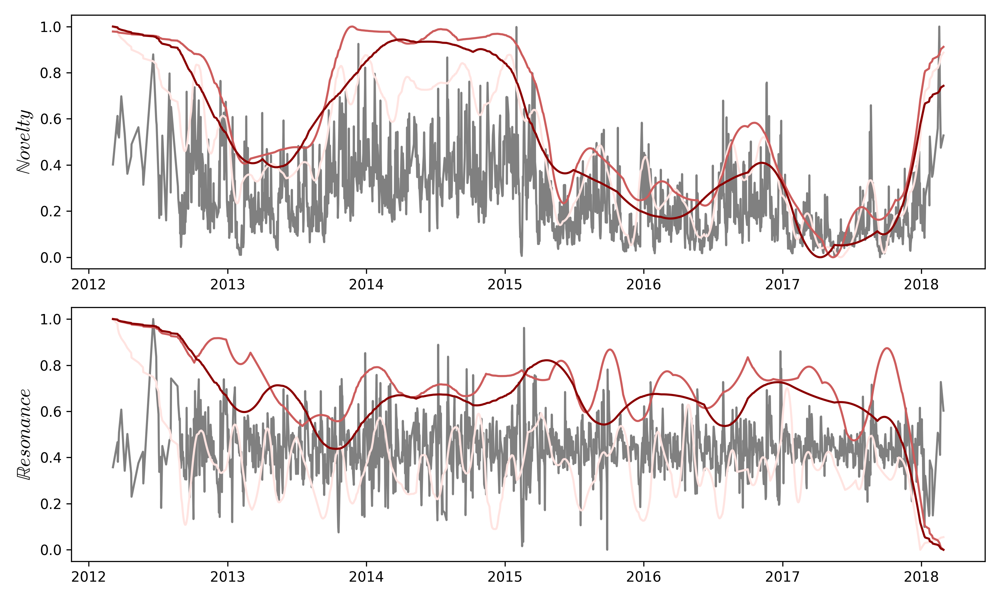
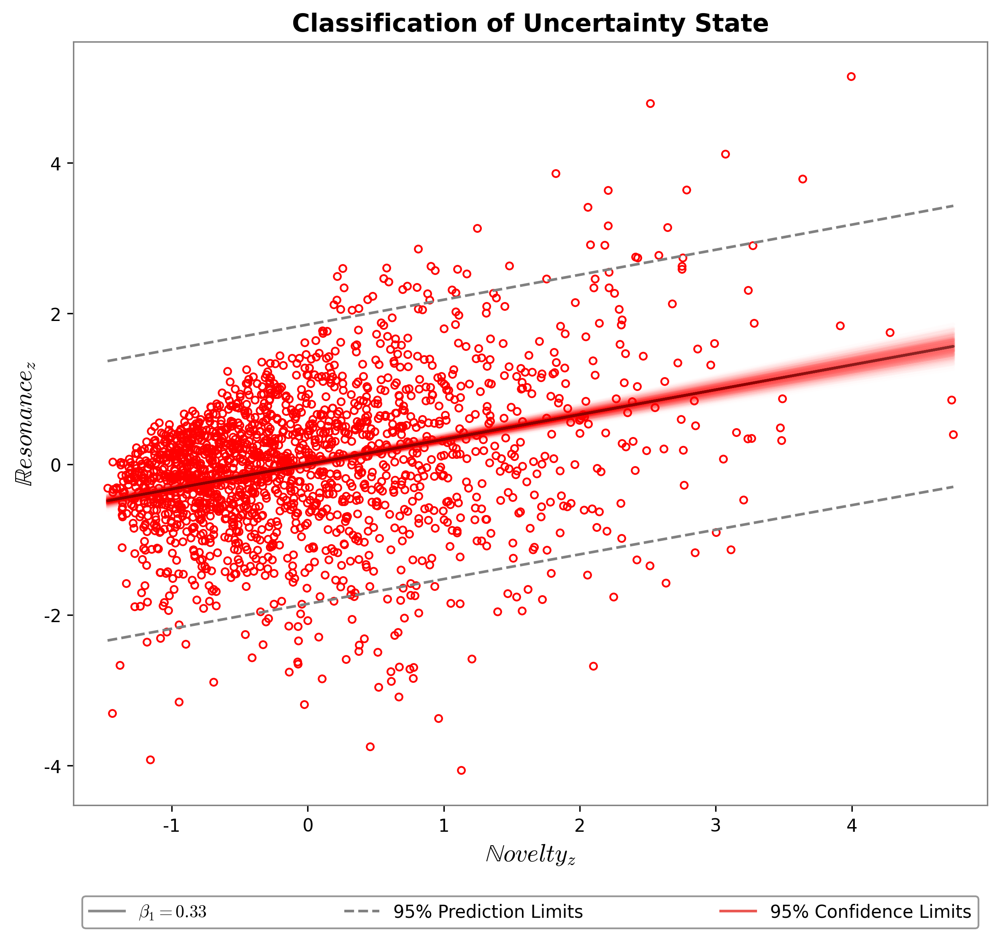
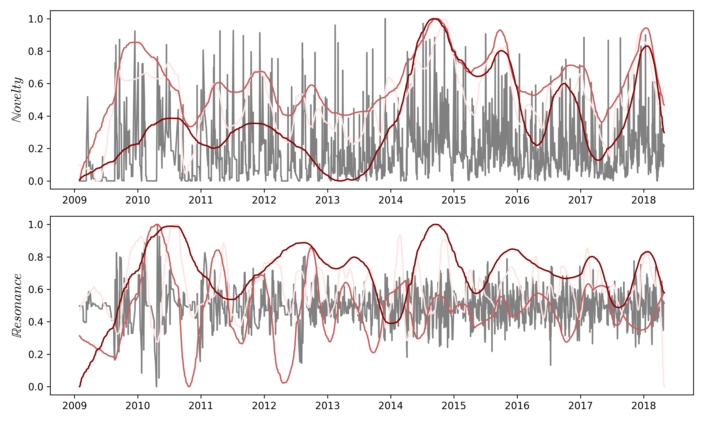

## Week 40 summary ##

### Internal information flow ###

Of two systems: Social media (FB) and legacy media (IM).

#### FB ####

We modeled content using seeded LDA, maximum coherence at 21 topics.
Browse the topic model [here](models/200826_seed_prior_test/plots/21T_005A_05E_seed_pyldavis.html)  

Information flow modeled on daily average topic composition day, over __1829 days__.
Starting 2012-01-09, ending 2018-03-21

    
    <em>
        Unfocused debate between 2014 and 2015 - new content introduced constantly.  
        This stops sharply in early 2015.
    </em>

    
    <em>
        New content is propagated in the debate, but has a limited longevity.
        Slope of this relationship is typically lower on SoMe compared to legacy Me.
    </em>

#### IM ####

data: IM subset, pre September 2020.

Content modeled using unsupervised LDA, maximum coherence at 6 topics.
Browse the topic model [here](models/200915_IMda_asm/plots/6T_ASM_pyldavis.html).  

Information flow modeled on daily average topic composition day, over __2133 days__.
Starting 2009-01-06, ending 2018-05-06.

    
    <em>
        The media landsape is very volatile before 2014; Novelty spiking at seemingly random times without an overall trend.
        From mid-2014 however, there is a clear increase of novel content in the system.
    </em>

    
    <em>
        News outlets differ in the way they handle information.
        Because we model them together here, we see 
        a) clusters of media where Resonance grows sharply with Novelty 
        b) and others where the relationship is much weaker.
        
        The overall relatinship is also very weak for legacy media.
        According to Kristoffer, beta > 0.5 indicates a healthy debate with enough focus on topics discussed.
    </em>

